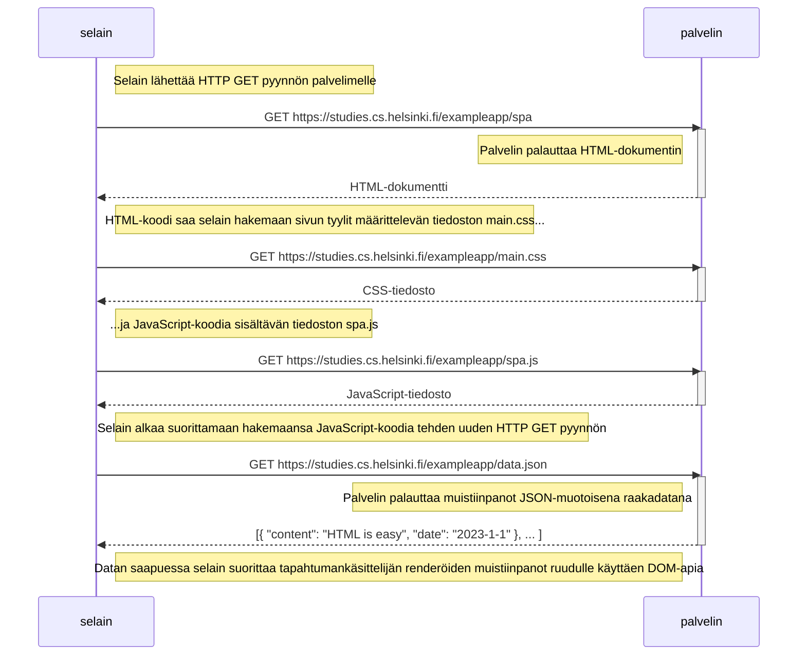

```mermaid
sequenceDiagram
    participant selain
    participant palvelin
    
    Note right of selain: Selain lähettää HTTP GET pyynnön palvelimelle

    selain->>palvelin: GET https://studies.cs.helsinki.fi/exampleapp/spa
    activate palvelin

    Note left of palvelin: Palvelin palauttaa HTML-dokumentin

    palvelin-->>selain: HTML-dokumentti
    deactivate palvelin

    Note right of selain: HTML-koodi saa selain hakemaan sivun tyylit määrittelevän tiedoston main.css...

    selain->>palvelin: GET https://studies.cs.helsinki.fi/exampleapp/main.css
    activate palvelin

    palvelin-->>selain: CSS-tiedosto
    deactivate palvelin

    Note right of selain: ...ja JavaScript-koodia sisältävän tiedoston spa.js
    
    selain->>palvelin: GET https://studies.cs.helsinki.fi/exampleapp/spa.js
    activate palvelin

    palvelin-->>selain: JavaScript-tiedosto
    deactivate palvelin
    
    Note right of selain: Selain alkaa suorittamaan hakemaansa JavaScript-koodia tehden uuden HTTP GET pyynnön
    
    selain->>palvelin: GET https://studies.cs.helsinki.fi/exampleapp/data.json
    activate palvelin

    Note left of palvelin: Palvelin palauttaa muistiinpanot JSON-muotoisena raakadatana

    palvelin-->>selain: [{ "content": "HTML is easy", "date": "2023-1-1" }, ... ]
    deactivate palvelin    

    Note right of selain: Datan saapuessa selain suorittaa tapahtumankäsittelijän renderöiden muistiinpanot ruudulle käyttäen DOM-apia
```