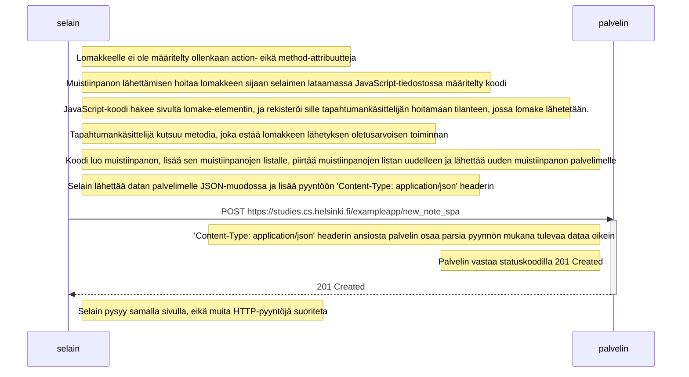

```mermaid
sequenceDiagram
    participant selain
    participant palvelin
    
    Note right of selain: Lomakkeelle ei ole määritelty ollenkaan action- eikä method-attribuutteja

    Note right of selain: Muistiinpanon lähettämisen hoitaa lomakkeen sijaan selaimen lataamassa JavaScript-tiedostossa määritelty koodi

    Note right of selain: JavaScript-koodi hakee sivulta lomake-elementin, ja rekisteröi sille tapahtumankäsittelijän hoitamaan tilanteen, jossa lomake lähetetään.
    
    Note right of selain: Tapahtumankäsittelijä kutsuu metodia, joka estää lomakkeen lähetyksen oletusarvoisen toiminnan

    Note right of selain: Koodi luo muistiinpanon, lisää sen muistiinpanojen listalle, piirtää muistiinpanojen listan uudelleen ja lähettää uuden muistiinpanon palvelimelle

    Note right of selain: Selain lähettää datan palvelimelle JSON-muodossa ja lisää pyyntöön 'Content-Type: application/json' headerin

    selain->>palvelin: POST https://studies.cs.helsinki.fi/exampleapp/new_note_spa
    activate palvelin

    Note left of palvelin: 'Content-Type: application/json' headerin ansiosta palvelin osaa parsia pyynnön mukana tulevaa dataa oikein

    Note left of palvelin: Palvelin vastaa statuskoodilla 201 Created

    palvelin-->>selain: 201 Created
    deactivate palvelin
    
    Note right of selain: Selain pysyy samalla sivulla, eikä muita HTTP-pyyntöjä suoriteta
    
```